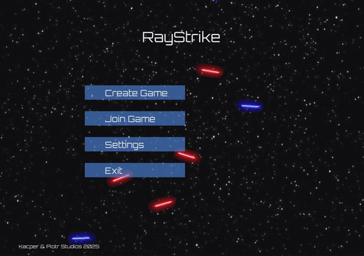
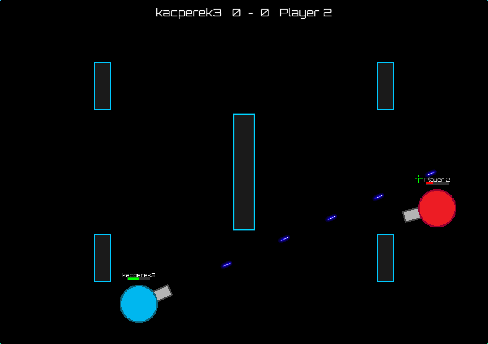

<h1 align="center">RayStrike: C++ Multiplayer Shooter</h1>

<p align="center">
  Multiplayer top-down shooter built entirely from scratch in <strong>C++17</strong> and <strong>SFML</strong>.
  <strong>7,500+ lines </strong> of pure code across <strong> 50+ source files </strong>. Zero external engines.
</p>

<p align="center">
  
  
  
  
  
</p>

<br>

---

## Features

* **Custom State Machine:** Memory-safe scene transitions (Menu, Lobby, Gameplay). [📖 Read more](docs/engine.md)
* **Hybrid TCP/UDP Networking:** TCP for reliable lobby handshakes; custom UDP for zero-latency combat sync. [📖 Read more](docs/networking.md)
* **Multithreaded Architecture:** Background network I/O ensures an unblocked, locked-60-FPS game loop. [📖 Read more](docs/multithreading.md)
* **Lobby System:** Host/join rooms, nickname synchronization, and ready-up states. [📖 Read more](docs/lobby.md)
* **1v1 Arena Combat:** Real-time top-down shooting, precise AABB collisions, and dynamic UI.
* **CMake Build:** Clean, cross-platform configuration for instant compiling.

---

##  Multiplayer in Action

<table align="center">
  <tr>
    <th align="center"> Host (Creating Match)</th>
    <th align="center"> Guest (Joining Match)</th>
  </tr>
  <tr>
    <td width="50%">
      
    </td>
    <td width="50%">
      
    </td>
  </tr>
</table>
<table align="center">
  <tr>
    <th align="center"> Host (Lobby)</th>
    <th align="center"> Guest (Lobby)</th>
  </tr>
  <tr>
    <td width="50%">
      
    </td>
    <td width="50%">
      
    </td>
  </tr>
</table>


<br>

<h3 align="center">Real-Time Arena Combat</h3>
<p align="center">
  
</p>


---
## ️ Installation & Building
This project uses **CMake** for building. I have provided a simple helper script to automate the process for you.

### Prerequisites
* **Linux:** `g++`, `cmake`, `libsfml-dev`
* **Windows:** Visual Studio (with C++) or MinGW, and CMake.

###  The "One-Click" Run (Recommended)

1.  Clone the repository:
    ```bash
    git clone https://github.com/Kacperek3/RayStrike.git
    cd Raystrike
    ```

2.  Run the build script:
    ```bash
    # Make the script executable (Linux/Mac only)
    chmod +x build_and_run.sh

    # Build and Run in Release mode 
    ./build_and_run.sh Release
    ```

**That's it!** The script will automatically configure CMake, compile the source code, and launch the game.

---

## Controls

| Key / Action | Description |
| :--- | :--- |
| **W, A, S, D** | Move your character |
| **Mouse** | Aim your weapon |
| **Left Click** | Fire |
| **R** | Request rematch (when the round is over) |


## Development Roadmap

**Phase 1: Core Foundation (Completed)**
- [x] Custom C++ Engine & State Machine
- [x] Hybrid TCP/UDP Networking Protocol
- [x] Asset & Audio Management System

**Phase 2: Gameplay Expansion (Up Next)**
- [ ] New Weapons (Different types and fire rates)
- [ ] New Maps and Obstacles
- [ ] Bullet Ricochets and Power-ups


---

##  License

This project is licensed under the MIT License - see the [LICENSE](LICENSE) file for details.